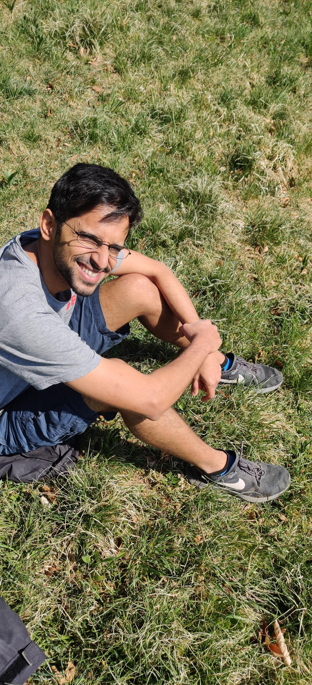

title: About 
slug: about
date: 2020-04-09 10:04:01 UTC+02:00
tags: 
category: 
link: about
description: 
type: text

I'm a behavioural and sensory biologist interested in studying how animals do the crazy things they do.
Some of the animals I've studied (and am studying) are social spiders, bats, and...plants. I like to mix behavioural observations, sensory measurements, modelling and technology with
lots of  Python code everywhere and understand more about the how and why of animal behaviour. 

{height=300px}{height=300px}{height=300px}

Thanks for landing up here, and do check  out the other pages about my research, publications, and my blog where I write mostly about 
science and scientific computing.

### *Updates*
* I'm currently heading on the path to finishing up my PhD, and am looking for potential labs to do a post-doc. I'm particularly interested in projects that involve a mix 
of computational and experimental components to it with sensory biology and image/signal analysis involved. I'd also be interested to talk about the possibility of continuing
work on a high spatio-temporal resolution dataset of echolocating bat groups I collected  during my PhD. Visit [this page](../usho-visho) for more details on why I think this dataset is cool and unique! 

