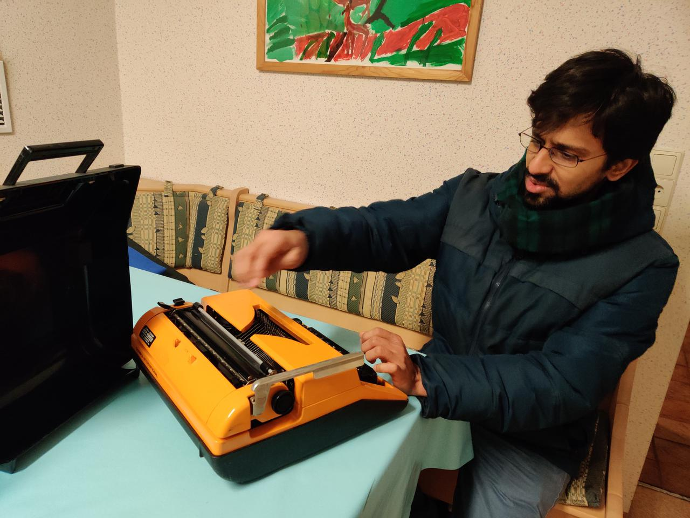

title: Code
slug: code
date: 2020-04-20 10:47:48 UTC+02:00
link: code
type: text

{width=300px}

* ### My <a href="https://github.com/thejasvibr" target="_blank">Github profile</a>

* ### Reproducible code
In the recent past I've been trying to make as much of the actual data crunching, analysis and visualisation as computationally reproducible as possible. This means avoiding steps which include clicks with a mouse, or manual copy-pasting of files.
In the Python and R ecosystems, it is incredibly easy to do this using the rich package system and Jupyter notebooks. The first paper from my PhD was a computational  model of bat echolocation in groups, and the essential parts of the paper (results, analysis and  plots) can be independently recreated by running a couple of files. Check it out <a href="https://github.com/thejasvibr/the_cocktail_party_nightmare" target="_blank">here</a>. I went on to do this for more papers, and this is the normal approach I'm now planning to continue - including automating all table entries and formatting. One of my more recent papers with fully reproducible outputs [here](https://github.com/thejasvibr/mhbc-online).

* ### Python packages
    * ```beamshapes```: a package that implements directivity patterns for sound sources. The directivity of a sound source dictates how directional or omnidirectional sound radiation is from a source. While there are many published solutions - they tend to be in-house scripts written in proprietary languages. This is my attempt at implementing directivities for universal access to the acoustics and bioacoustics community. [Project page](https://beamshapes.readthedocs.io/en/latest/)
    * ```itsfm```: In the context of quantifying horseshoe bat calls I've been working on a Python package to identify and segment sounds based on their frequency modulation. The package is called *itsfm*. Check out the project page <a href="https://itsfm.readthedocs.io/en/latest/" target="_blank">here</a>. 
    

* ### Android apps with Kivy
Smartphones are everywhere and I've always been curious to start playing around with them, and may be use them for a research project at some point. Using the <a href="https://kivy.org/#home" target="_blank")>Kivy</a> 
Python package I've recently been playing around and making small (and rather trivial) apps. Check out these repos and try them out yourself: <a href="https://github.com/thejasvibr/screenbash" target="_blank">screenbash</a>, <a href="https://github.com/thejasvibr/youscrolled" target="_blank">youscrolled</a>.
