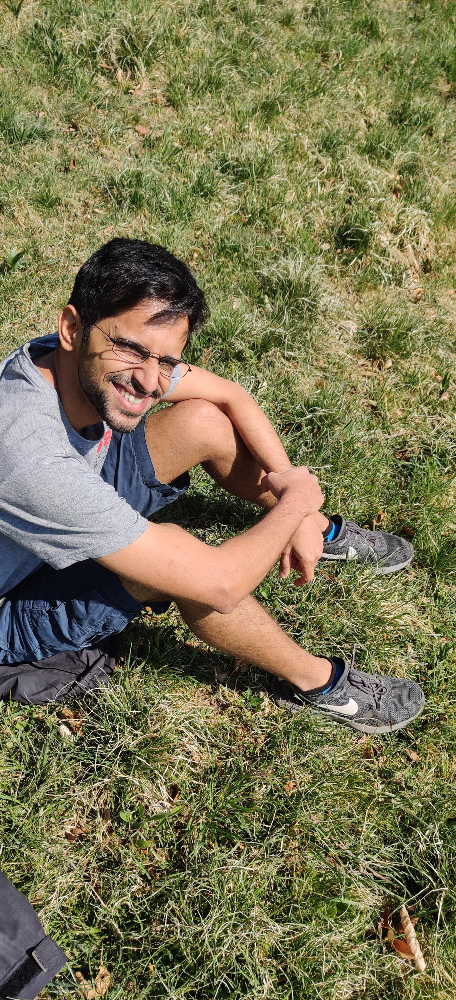

title: About 
slug: index
date: 2020-04-09 10:04:01 UTC+02:00
tags: 
category: 
link: about
description: 
type: text

I'm a behavioural and sensory biologist interested in studying how animals do the crazy things they do.
Some of the animals I've studied (and am studying) are social spiders, bats, and...plants. I like to mix behavioural observations, sensory measurements, modelling and technology with
lots of  Python code everywhere to understand more about the how and why of animal behaviour. 

{height=300px}{height=300px}{height=300px}

Thanks for landing up here, and do check  out the other pages about my research, publications, and my blog where I write mostly about 
science and scientific computing.

### *Updates*
* 2021-07-30: Do social-spiders save silk in groups, and how does web structure change with group size? Our latest paper is finally out: check it out [here](../publications) or [here]( https://authors.elsevier.com/a/1dUf7mjLwpTu) 
* Say hello to Herr Doktor Beleyur - PhD certificate in my hands. PhD Thesis link [here](http://kops.uni-konstanz.de/handle/123456789/54323).
* PhD'ed sucessfully! Now waiting to get the certificate!
* Online PhD defence scheduled on 10/6/2021!

