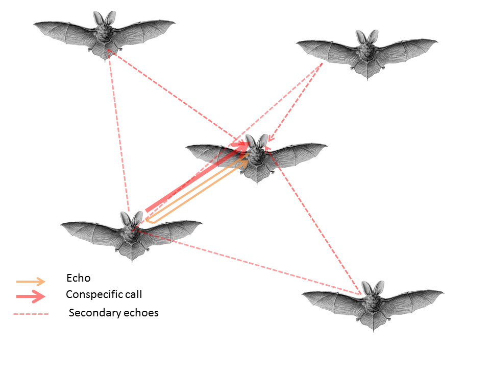
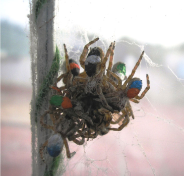
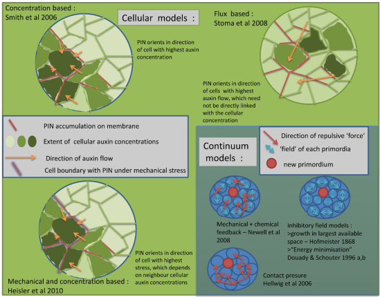

	.. title: Publications
.. slug: publications
.. date: 2020-04-19 17:41:40 UTC+02:00
.. link: publications
.. type: text

2019
~~~~

.. image:: ../images/icassp_cave_exxpt.png
   :height: 10 pc

* **Beleyur, T.**, & Goerlitz, H. R. (2019). Modeling active sensing reveals echo detection even in large groups of bats. Proceedings of the National Academy of Sciences, 116(52), 26662-26668. 

* Batstone, K., Flood, G., **Beleyur, T.**, Larsson, V., Goerlitz, H. R., Oskarsson, M., & Åström, K. (2019, May). Robust Self-calibration of Constant Offset Time-difference-of-arrival. IEEE International Conference on Acoustics, Speech and Signal Processing (ICASSP) (pp. 4410-4414). IEEE. 

2018
~~~~

.. youtube:: AxDdBvLjSMQ
   :height: 250 px
  
* Kamburov, A., Goerlitz, H. R., **Beleyur, T.**, 2018, Geospatial modelling inside the "Orlova Chuka" cave in Bulgaria, *non-peer reviewed conference contribution*,  XXVIII International Symposium on Modern Technologies and Professional Practise in Geodesy and related fields

2015
~~~~

* **Beleyur, T.**, Bellur, D. U., & Somanathan, H. (2015). Long-term behavioural consistency in prey capture but not in web maintenance in a social spider. Behavioral Ecology and Sociobiology, 69(6), 1019-1028.

2013 
~~~~

* **Beleyur, T.**, Abdul Kareem, V. K., Shaji, A., & Prasad, K. (2013). A mathematical basis for plant patterning derived from physico‐chemical phenomena. Bioessays, 35(4), 366-376.
