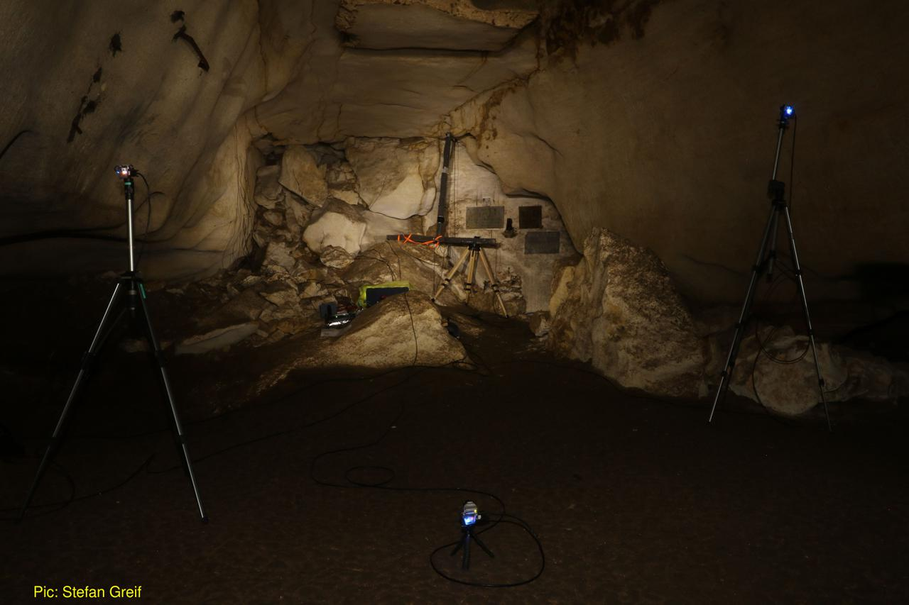
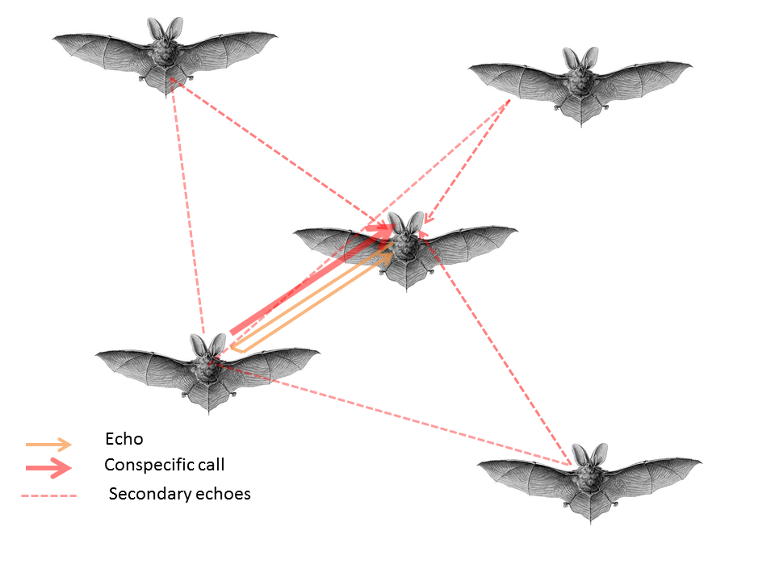
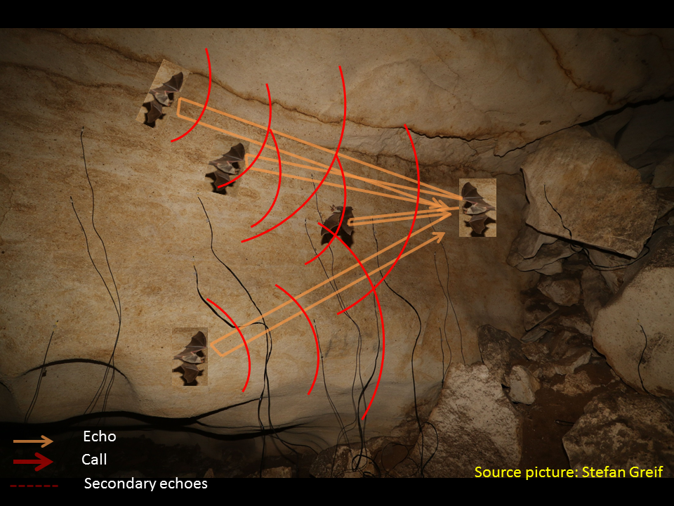

title: The Ushichka Dataset: waiting to be analysed!
slug: usho-visho
date: 2020-04-22 08:30:13 UTC+02:00
tags: 
category: 
link: 
description: 
type: text

{height=300px}||{height=300}

As part of my PhD looking at how bats manage to [echolocate in groups](../research), I collected a multichannel audio-video dataset consisting of between 12-22 microphones and three thermal cameras.
I call this combined recording system 'Uschichka' (Ушичка) (*OO-shi-ch-kaa*), the Bulgarian dimunitive for something with multiple ears. The Uschichka system was built with [Holger R Goerlitz](https://www.orn.mpg.de/person/26282/2902144) to record bat
groups as they echolocate in their natural habitat. The dataset can provide direct glimpses into how bats change their flight and echolocation behaviours as 
the group size around them increases. 

## Why is it interesting?
* ### Reconstructing the sensory umwelt of a bat in a group - sensory input to  flight behaviour in bat groups:
	The nice part about having so many cameras and microphones is that  the sensorimotor decisions of each bat in a group can be tracked very well. How close
	did a bat fly to its neighbour, when did it swerve away, what did its call look like (duration, spectrum, etc). The cave  that they're flying in has also been LiDAR scanned 
	(check out the fly-through video from the Kamburov et al 2018 paper [here](../publications). 

	The combination of 3D video and acoustic tracking along with the cave scans basically provide us a rather 'controlled' environment in which we can infer the sensory inputs
	and outputs of each bat! This 'multi-modal' dataset allows a detailed study of the what, how and why bats are able to fly and echolocate in groups.  

* ### Exploiting the underlying variation in group size

	The cool thing about studying animals in their natural environment is that you end up observing a larger variety of their behaviours. For instance, bat aggregations grow from a 
	few bats to many bats over the course of an hour or two after sunset. This allows a comparison of how flight and echolocation behaviours change with group size over the course
	of an evening and across multiple evening. Even though the bats leave at more or less the same time in the evening - they return as individuals just before sunrise. The fact
	that they arrive as individuals is a nice natural 'control' to understand how bats will fly and echolocate as individuals, in comparison to how they do it in groups!.
	
	The Usho-Visho dataset consists of short automatically triggered recordings (10-20s length) starting at sunset and going all the way till sun rise. This means each 'night' of 
	recording captures the entire variation in bat behaviour across group sizes in a *constant* environment. 

* ### Comparing observed data with predictions
{height=300px}||{height=300px}

*Left: schematic based on our 2019 model showing the different types of sounds in echolocating groups, Right: schematic showing the same masking sounds in the field, and how they can be estimated/measured in the field*

I've been working on how bats manage to echolocate in groups over the course of my PhD, and have a series of predictions outlined in [this paper](https://www.pnas.org/content/116/52/26662.short).
The computational model was built to simulate the acoustical and sensory phenomena bats may be experiencing while echolocating in groups, and was parametrised with 
experimentally observed values typical of an 'average' bat. The idea would be to parametrise this computational model for the behaviour of the study species in the recordings 
(*Myotis myotis*) and run new predictions to see whether the observed changes they  show actually lead to decreased masking in the group. The simulations in the paper above
were 'static' simulations with no dynamic nature. Real bats of course sense their world dynamically and alter/update their sensorimotor decisions according to  the inputs they 
receive. 

## The technical details:

* ### Frame synchronised and 3D calibrated video recordings with 3 thermal cameras

	{height=300px}||{height=300px}

	*Note: The 2 GIFS here are sometimes displayed with a bit of delay - the actual video data is frame synchronised!*

	Three thermal cameras running at 25Hz were automatically triggered to start recording whenever the sound levels increased beyond a threshold. The cameras
	were [TeAx ThermalCapture 2.0](https://thermalcapture.com/thermalcapture-2-0-640/) models running with custom trigger circuits. 

* ### Multi-channel audio recordings 

	{height=200}||{height=200px}||{height=200px}
	
	I started out with 12 microphones and had 22 mics by the end of the field season! All audio was recorded by a combination of Fireface USB devices 
	running at 192 kHz. I used only one array with four microphones (the inverted T-shaped thing visible in the GIF on top) and the rest of the microphones
	were placed on the walls of the cave to keep  the whole recording system as unobtrusive as possible to the bats. 

* ### Tracking bat aggregations with the combined power of acoustic *and* video tracking
The data from the recording system is in the form 10-15 second files with multichannel video at 25Hz and audio recorded at 192 kHz.
For every recording in the Uschichka dataset an acoustic trajectory and a video trajectory can be produced from the mics and cameras respectively.
The microphones capture bat locations whenever bats emit calls at 10Hz, while the video trajectory generates bat locations even when the bats are not calling.
In addition, the two trajectories can be used complementarily when bats occlude each other on camera, or an acoustic localisation is ambiguous. 
The challenge in analysing the Uschichka dataset is in the audio. With current conventional methods upto two bats can be tracked at a time. 
However, even with three or more bats, the calls begin to arrive with near or complete overlap at the microphones – and this is where conventional acoustic tracking fails. 

## Supporting datasets/methods around Uschichka:
* LiDAR scans of the cave
The whole recording volume and a sizeable area of the cave around it has been scanned with a LiDAR scanner by [Asparuh Kamburov](https://www.linkedin.com/in/asparuh-kamburov-baa58525/?originalSubdomain=bg).
The details of the scanning and data collection are described in our [2018 report](../publications). The dataset serves as a nice basis to investigate
how bats flying within the volume make their sensorimotor decisions. Through tracking we can estimate when the bats emitted their calls, and the LiDAR scans allow
a calculation of the time of arrival and intensity of the sounds. Some cool 'room acoustics' could be done using basic ray tracing perhaps to simulate sound propagation (with a package like
[pyroomacoustics](https://pyroomacoustics.readthedocs.io/en/pypi-release/index.html)?

* Automatic microphone position calibration
Working with many microphones *not* on arrays means constantly having to measure their positions and inter-mic distances. While this is feasible for 
a few mics, the number of measurements to be made with more mice increases horribly fast. While looking for automated solutions to this problem I reached out
to [Kalle Åström](http://www.maths.lu.se/staff/kalleastrom/) and with example audio playbacks made in the cave, we were able to show the automatic inference of
mic positions just from playbacks. If you haven't worked with acoustic localisation this may seem uninteresting, but if you have - you'll be delighted hearing that
such things are in development :P!. A part of  the Uschichka dataset was used for the paper published on this method. See [Batstone et al 2019](../publications) 
for more details. 
## Taking it forward
This is only a teaser of the whole dataset and the things that could be done with it. It may already be too much information. 
I'd be happy to talk with you about potential ways to take the analysis of this dataset forward as a postdoc!

### Acknowledgements
Of course, even though I said that *'I'* collected the dataset, the data collection was only truly possible thanks to a whole group of people backing it at every point along the way.
Aditya Krishna and Neetash Mysuru helped with data collection in the caves, Antoniya Hubancheva for sparking the whole idea of doing the field work at the Siemers field station itself,
and the rest of the Tabachka crew for the awesome times. Благодаря, danke schon, tak, and thanks to all of you (named, and not named) in this section. 
{height=300px}
