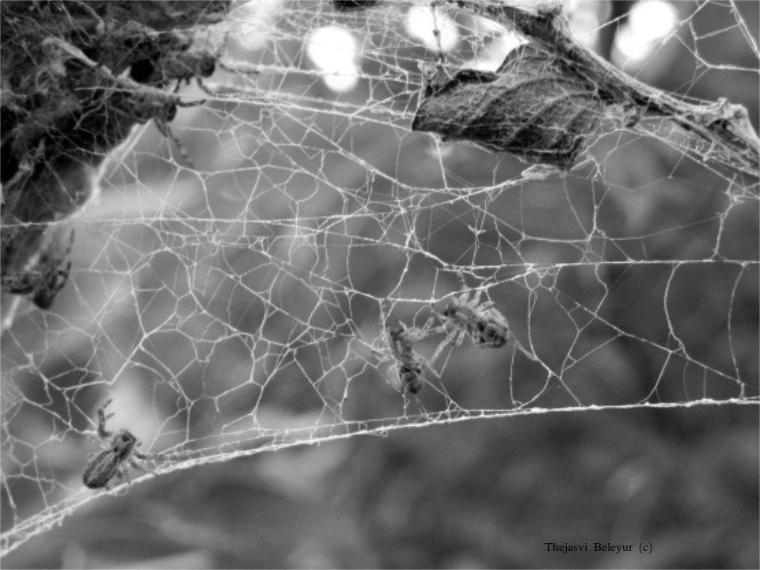

.. title: Research
.. slug: research
.. date: 2020-04-19 17:41:35 UTC+02:00
.. tags: 
.. category: 
.. link: research
.. description: 
.. type: text

The cocktail party nightmare : how do groups of bats echolocate? 
~~~~~~~~~~~~~~~~~~~~~~~~~~~~~~~~~~~~~~~~~~~~~~~~~~~~~~~~~~~~~~~~
Echolocating bats emit very loud calls and listen for the faint
returning echoes to figure out where things are. This works 
pretty  well when they're flying alone, but when in a group
things might start to get very tricky. Each bat in a group emits very loud
calls about ten times per second. Every bat in the group is also 
trying to listen for its own (faint)  echoes in the midst of all the
loud sounds (calls and echoes) from their neighbours. 

Even though we think of it as a challenging situation (the cocktail party nightmare), 
many bat species don't seem to be bothered by it. Bats are very social animals
and even display impressive feats of group flight as they emerge in the evening
or even within the cave itself. 

.. image:: ../images/orlova_chuka.gif
   :width: 49 %

My research seeks to answer how they manage to fly despite the tricky 
sensory conditions. I use computational sensory modelling along with
experimental observations with video-acoustic tracking to quantify 
the sensory  inputs a bat in a group might be receiving. In a recent `paper <https://www.pnas.org/content/116/52/26662.short>`_ we showed that even though echolocation does get harder with increasing grop sizes, bats 
may still be detecting at least one echo per call. I also use performed video and acoustic 
tracking of bats as they echolocate in their caves. While the hardware technology
to do this has been in place for some time now, it's only recently that the 
signal-processing and tracking methods are coming into place. I'm looking 
forward to analyse the one-of-a-kind `dataset <../usho-visho>`_ of which the GIF above is just a tiny part of!

Social spiders : task division and web construction
~~~~~~~~~~~~~~~~~~~~~~~~~~~~~~~~~~~~~~~~~~~~~~~~~~~
Most spiders are actually very asocial. If you were to put two spiders in a 
box, at the end of the day you'd typicallly have just one of them alive. In contrast
to the 'classic' spider way of doing things, there just about 40 species of 
spiders that are positively social. Two social spiders  in a box will actually end up in the same corner at the end of the day. As a result of their sociality social spiders can do many things a typical solitary spider cannot. A nice example is that social spiders can build *huge* webs, or capture prey much larger than
they would be able to alone. 

.. image:: ../images/stegos_on_web.gif
   :width: 49 %

Despite their coolness as spiders, they have been relatively under-studied. For
instance, even though they live in groups, it wasn't quite clear if social 
spider groups individuals were task specialised, as in some honey bee and 
any species. Moreover, all spiders in a group look the same. We looked at 
whether there was individual propensities to capture prey and participate
in web maintenance and building and saw that there were indeed spiders
that consistently participated more in prey-capture, but that this could 
be modulated by hunger-levels. Later on, I was part of an inter-disciplinary team that looked
at how social spider webs develop over time. 

Plant phyllotaxis: where  do leaves end up growing? 
~~~~~~~~~~~~~~~~~~~~~~~~~~~~~~~~~~~~~~~~~~~~~~~~~~~
Plant leaves and flowers can be arranged in very cool patterns. A really 
nice intricate pattern is the `romanesco broccoli <https://upload.wikimedia.org/wikipedia/commons/4/4f/Fractal_Broccoli.jpg>`_ broccoli. This pattern of leaf/stem placement
in a plant is called phyllotaxis. These patterns have of course fascinated many 
people over the past few centuries, and more recently experimental and computational work has shown that new leaves begin 
to grow wherever plant hormones, called auxins accumulate. My first encounter with hands-on computational modelling. Even though
the computational modelling was looking at various simulations that had
previously replicated the different leaf arrangements by detailed models of 
auxin flow and accumulation in cells. My own modelling didn't work out so well back then, but I was lucky enough to
contribute to a review paper on the recent methods and results in the experimental and computational 
fields of phyllotaxis. 
